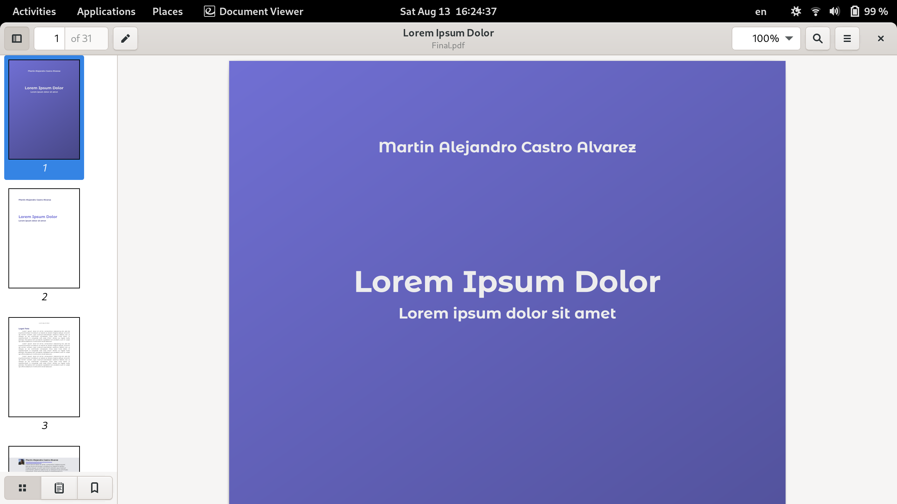
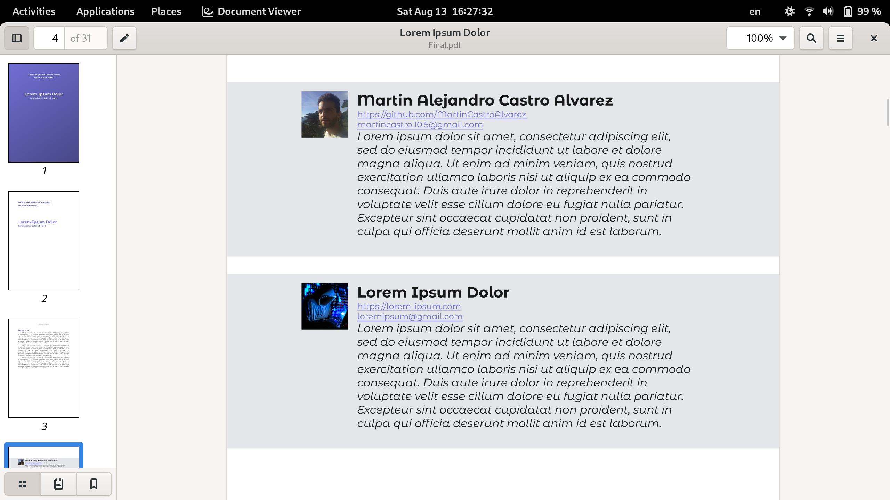
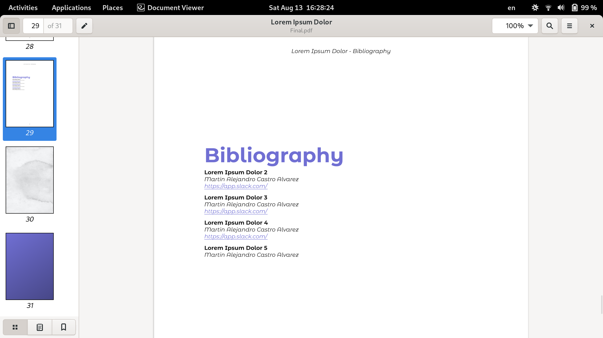
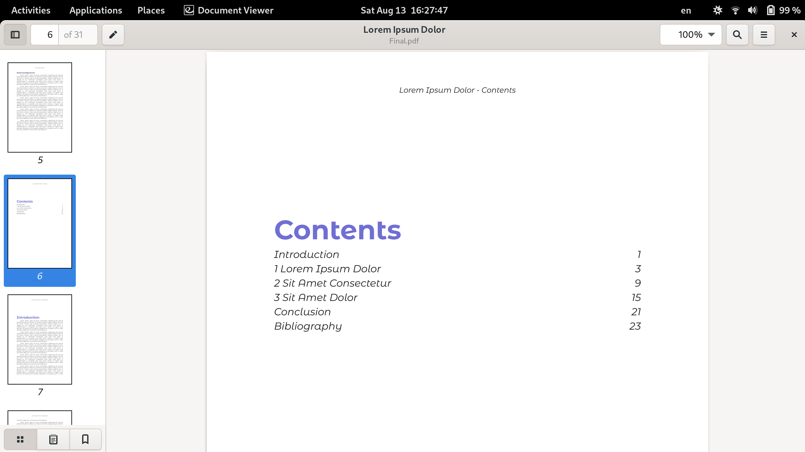
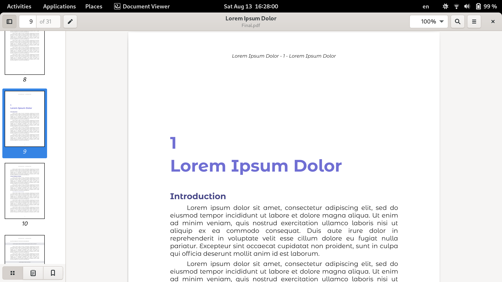
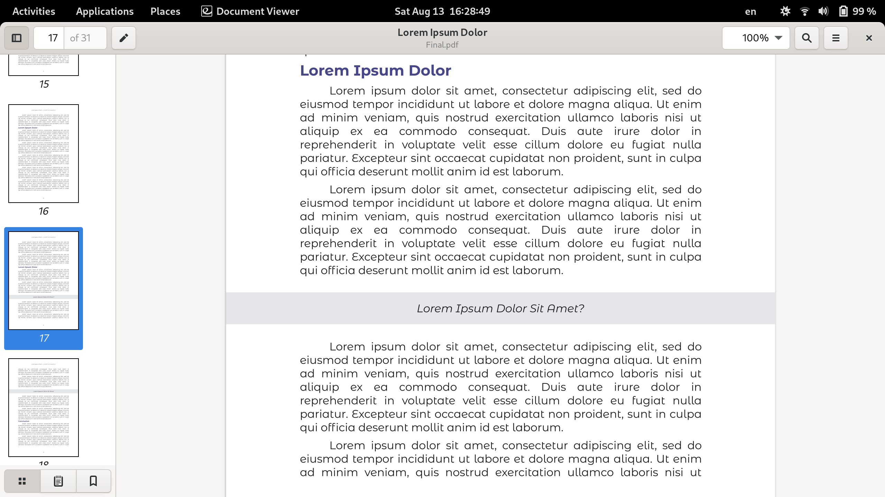

# VEL
Book rendering with Node & Typescript


### References

- [http://pdfkit.org/](http://pdfkit.org/)

## Example

### Rendering a book cover



### Rendering information about the authors



### Rendering the bibliography



### Rendering the table of contents



### Rendering chapters



### Rendering rich text



## Architecture

### Overview

TBD

### Struecture

#### Configuration

|Link|Description|
|--|--|
|[persons](./persons)|Directory with YAML files with personal details that can be referenced.|
|[topics](./topics)|Directory with YAML files with topics details that can be referenced.|
|[config](./config)|Directory with YAML files with general configuration.|
|[books](./books)|Directory with YAML files defining books.|
|[i18n](./i18n)|Directory with YAML files defining translations.|

#### Content

|Link|Description|
|--|--|
|[fonts](./fonts)|This directory contains the files defining fonts.|
|[images](./images)|This directory contains the images files that can be referenced.|

#### Application

|Link|Description|
|--|--|
|[render.js](./render.js)|The Node command line interface for rendering content.|
|[builds](./builds)|This directory containes the results of rendering the books.|
|[package.json](./package.json)|The JSON file with all the dependencies required by this application.|
|[src](./src)|This directory contains the Node code that implements this application.|
|[src/command.ts](./src/command.ts)|Application command line interface handler.|
|[src/enums](./src/enums)|Application constants.|
|[src/interfaces](./src/interfaces)|Application interfaces.|
|[src/models](./src/models)|Application models.|
|[src/serializers](./src/serializers)|Application serializer interfaces.|
|[src/products](./src/products)|Application products.|
|[src/section](./src/draft)|Application product section.|
|[src/errors](./src/errors)|Application errors.|

## Instructions

### Installation

```bash
yarn install
```

### Rendering a PDF in English
```bash
yarn run build && yarn run render --title "sample" --language "en" --format "pdf"
```

The PDF is available at [./builds/sample/pdf/en/final.pdf]

### Rendering a PDF in Spanish

```bash
yarn run build && yarn run render --title "sample" --language "es" --format "pdf"
```

The PDF is available at [./builds/sample/pdf/es/final.pdf]

### Rendering a PDF in multiple languages

```bash
yarn run build && yarn run render --title "sample" --language "en,es" --format "pdf"
```

The PDF is available at [./builds/sample/pdf/es/final.pdf] and [./builds/sample/pdf/en/final.pdf]
