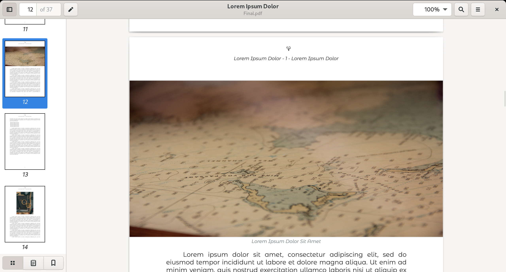
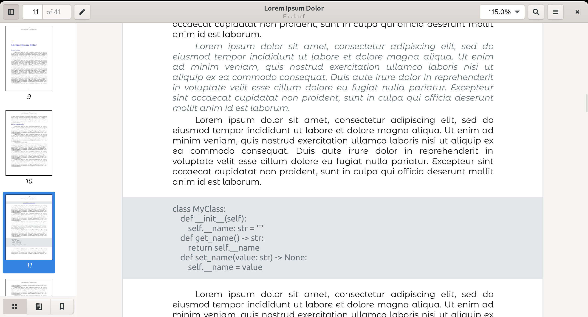
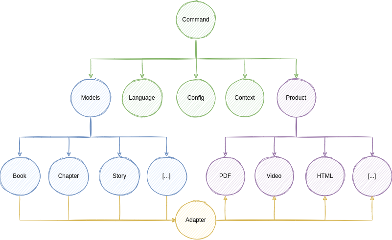

# VEL
PDF rendering with Node & Typescript


### References

- [http://pdfkit.org/](http://pdfkit.org/)

# Example

### Rendering a book cover


### Rendering information about the authors


### Rendering the bibliography


### Rendering the table of contents


### Rendering chapters


### Rendering rich text


### Rendering images




### Rendering code blocks



# Software Architecture



# Software Design Patterns

### [Adapter](https://refactoring.guru/design-patterns/adapter)

> Adapter is a structural design pattern that allows objects with incompatible interfaces to collaborate.

### [Abstract Factory](https://refactoring.guru/design-patterns/abstract-factory)

> Abstract Factory is a creational design pattern that lets you produce families of related objects without specifying their concrete classes.

### [Facade](https://refactoring.guru/design-patterns/facade)

> Facade is a structural design pattern that provides a simplified interface to a library, a framework, or any other complex set of classes.

### [Builder](https://refactoring.guru/design-patterns/builder)

> Builder is a creational design pattern that lets you construct complex objects step by step. The pattern allows you to produce different types and representations of an object using the same construction code.

### [Facade](https://refactoring.guru/design-patterns/facade)

> Facade is a structural design pattern that provides a simplified interface to a library, a framework, or any other complex set of classes.

### [Command](https://refactoring.guru/design-patterns/command)

> Command is a behavioral design pattern that turns a request into a stand-alone object that contains all information about the request. This transformation lets you pass requests as a method arguments, delay or queue a request’s execution, and support undoable operations.

### [Context](https://www.dre.vanderbilt.edu/~schmidt/PDF/Context-Object-Pattern.pdf)

> The goal of Context Object is not to pass lots of parameters to methods implicitly, as a means of by-passing strong typing and encapsulation. The goal is to store scoped data in a general, but managed way, independent of protocols and presentation technology.

# Software Structure

### Configuration

|Path|Description|
|--|--|
|[persons](./persons)|Directory with YAML files with personal details that can be referenced.|
|[topics](./topics)|Directory with YAML files with topics details that can be referenced.|
|[config](./config)|Directory with YAML files with general configuration.|
|[books](./books)|Directory with YAML files defining books.|
|[code](./code)|Directory with YAML files with code blocks that can be referenced.|
|[i18n](./i18n)|Directory with YAML files defining translations.|

### Content

|Path|Description|
|--|--|
|[fonts](./fonts)|This directory contains the files defining fonts.|
|[images](./images)|This directory contains the images files that can be referenced.|

#### Application

|Path|Description|
|--|--|
|[render.js](./render.js)|The Node command line interface for rendering content.|
|[builds](./builds)|This directory containes the results of rendering the books.|
|[src](./src)|This directory contains the Node code that implements this application.|
|[src/command.ts](./src/command.ts)|Application command line interface handler.|
|[src/enums](./src/enums)|Application constants.|
|[src/vocabulary](./src/vicabulary)|Application vocabulary used for scoring the quality of the text.|
|[src/interfaces](./src/interfaces)|Application interfaces.|
|[src/models](./src/models)|Application models.|
|[src/serializers](./src/serializers)|Application serializer interfaces.|
|[src/errors](./src/errors)|Application errors.|

#### Products

|Path|Description|
|--|--|
|[src/ebook](./src/products/ebook)|e-book rendering files.|
|[src/video](./src/products/video)|Video rendering files.|
|[src/html](./src/products/html)|HTML rendering files.|
|[src/course](./src/products/course)|Course rendering files.|

# Instructions

### Installation

```bash
yarn install
```

### Rendering a PDF in English
```bash
yarn run build && yarn run render --title "Sample" --language "en" --format "ebook"
```

The PDF is available [here](./builds/Sample/ebook/en/Final.pdf)

### Rendering a PDF in Spanish

```bash
yarn run build && yarn run render --title "Sample" --language "es" --format "ebook"
```

The PDF is available [here](./builds/Sample/ebook/es/Final.pdf)

### Rendering a PDF in multiple languages

```bash
yarn run build && yarn run render --title "Sample" --language "en,es" --format "ebook"
```

The PDF is available [here](./builds/Sample/pdf/es/Final.pdf) and [here](./builds/Sample/pdf/en/Final.pdf)

### Rendering a PDF in multiple languages
```bash
yarn run build && yarn run render --title "Start" --language "en" --format "ebook"
yarn run build && yarn run render --title "Start" --language "es" --format "ebook"
```
